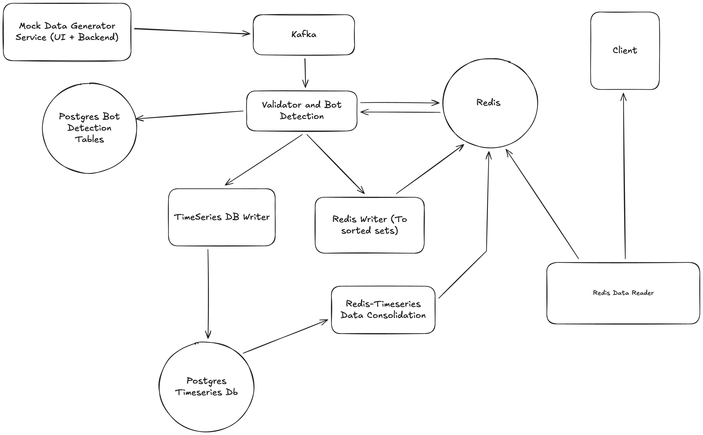

**INTRODUCTION**

This is a basic analytics service service that processes user events and provides basic real-time insights for three basic events:
▪ Active users count
▪ Top 5 pages
▪ Number of active sessions for the same user


User Events are sent by a mock data service and a mock payload can be found over here:
```
{
 "timestamp": "2024-03-15T14:30:00Z",
 "user_id": "usr_789",
 "event_type": "page_view",
 "page_url": "/products/electronics",
 "session_id": "sess_456"
}
```


**ARCHITECTURE**




Run the below step to create a POSTGRES DB to create the time series optimized table 

STEP 1: bring up a postgres instance in docker
```
docker run -d \
  --name timescaledb \
  -p 5432:5432 \
  -e POSTGRES_PASSWORD=postgres \
  -e POSTGRES_DB=analytics \
  timescale/timescaledb:latest-pg14
```

STEP 2: Connect to the instance in this manner:
```
docker exec -it timescaledb psql -U postgres -d analytics
```

Then bring up the tables as mentioned in tables.sql:
```
CREATE TABLE events (
    timestamp TIMESTAMPTZ NOT NULL,
    user_id TEXT,
    event_type TEXT,
    page_url TEXT,
    session_id TEXT
);

-- converts the above table to a timeseries optimized db
SELECT create_hypertable('events', 'timestamp');
```

Above steps will help to bring up a table which optimized for timeseries data

Then we would also need to create a table which would help to check maliciious users.

1. Connect to the docker postgres instance
```
docker exec -it timescaledb psql -U postgres
```

2. Create database mentioned in tables.sql
```
CREATE DATABASE botdb;
```

3. Create necessary tables
```
CREATE TABLE user_event_rate (
    user_id TEXT,
    time_bucket TIMESTAMP,
    event_count INT,
    PRIMARY KEY (user_id, time_bucket)
);

CREATE TABLE bot_users (
    user_id TEXT PRIMARY KEY,
    detected_at TIMESTAMP DEFAULT NOW(),
    reason TEXT
);
```

This will create the necessary tables 
